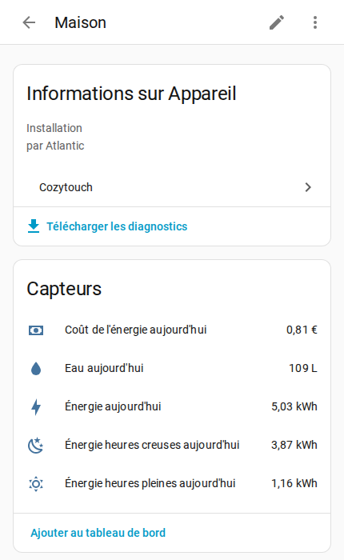

# 🏠 Atlantic Cozytouch

A Home Assistant integration for Atlantic's Cozytouch cloud -- boilers, heat
pumps, water heaters, towel rails and air conditioners.

Atlantic runs several protocols behind the Cozytouch brand. This one talks to
the API the Cozytouch mobile app uses, which is not the one the official
`overkiz` integration covers -- so it fills the gap for the hardware Overkiz
does not see.

## 📬 Contact

For anything about a device -- unmapped model, wrong entity, a value that reads
nothing like the app -- open an [issue](https://github.com/mathieuletyrant/cozytouch-hacs/issues)
and attach the diagnostics dump. A report without the dump cannot be acted on,
and an issue keeps the answer where the next person with that model will find
it.

For anything else -- something you would rather not post in public, or a
question that is not about the code -- <midtown_saucers9e@icloud.com>.

## ✨ What it does

You get the climate entity you would expect : temperature, mode, and fan and
swing where the hardware has them, with the room temperature read back. On top
of that :

- the weekly program the device runs on its own, read and written from Home
  Assistant, and shown as a calendar
- sensors per device for energy, water, wifi signal and decoded error codes
- what the home consumed today -- energy, split peak and off-peak, its cost,
  and water -- where the installation reports it, the figures the Cozytouch
  app shows on its consumption screen
- device triggers for schedule changes and program overrides, on top of the ones
  Home Assistant builds itself
- a diagnostics dump that an unmapped device points you at by itself
- an interface in English, French, Spanish, German and Italian, following the
  language Home Assistant is set to

Everything runs over the cloud : one login, one poll for the whole account,
every 60 seconds by default -- plus an immediate re-read whenever you change
something, so you never wait out the minute.

## 📋 Supported devices

There is no list, and that is the point.

The integration works out what a device is from what the API sends about it --
the `productId` Atlantic assigns it, the family it declares, and the interface
it hangs off. That is what Atlantic's own app reads, and it means a device
nobody has ever reported still arrives as the right kind of thing, with the
modes it says it supports and the entities its capabilities allow.

Boilers, heat pumps, water heaters, towel rails, room air conditioners,
electric radiators, heating circuits, hot water tanks, gateways and the zones
of a ducted unit are all recognised this way.

What a device reports is a list of numbered *capabilities*, and what each
number means used to be the whole difficulty -- a value on the wire with no
name and no unit, worked out one household at a time from the dumps people
send. Atlantic turns out to publish a catalogue of them: 405 capabilities with
a name, a description, a type, a unit, the bounds and the enum members. It is
used as a check rather than a replacement, because it names the *capability*
and not the entity, and it says nothing about which device reports what. The
reasoning is in `docs/decisions.md`, the routes in `docs/api-surface.md`.

### ❓ Something is missing or wrong

Open a [device report](https://github.com/mathieuletyrant/cozytouch-hacs/issues/new?template=device_report.yml).
The form asks for three things, and all three matter:

- **a diagnostics dump** --
  `Settings -> Devices & Services -> Cozytouch -> ⋮ -> Download
  diagnostics`. One file covers the whole account: every device the API
  returns, with what it says about each and the value of every capability it
  reports -- including the devices you have not added. It also carries what
  Atlantic's own catalogue says about each of those capabilities, which is
  most of what naming one takes. Your credentials and address are stripped out
  before it is written.
- **screenshots of the Cozytouch app** -- its home screen, the device's own
  screen, and the screens behind it. The dump says what a device *reports*;
  only these say what you can actually *do* with it, and the two are not the
  same. The rooms behind a Navizone report an eco capability the app never
  shows.
- **what you expected and what you got.** An entity that is not there, one
  reading a value you do not recognise, a control that does nothing.

Home Assistant raises a notice of its own when a device reports capabilities
nothing names yet, saying which ones and pointing at that form. Nothing is
broken when it appears -- it is a gap in the mapping, not a fault on the
hardware -- and it clears itself once the mapping catches up.

If you want to see the unnamed capabilities as entities in the meantime, tick
`Create entities for unknown capabilities` when adding the account, under
Configuration below. It is useful for working out what a value means, and
noisy enough that you will want it off again afterwards.

## 📦 Installation

### With HACS

This integration is not in the HACS default store, so add it as a custom
repository first :

Or by hand, in HACS : `⋮ -> Custom repositories`, URL
`https://github.com/mathieuletyrant/cozytouch-hacs`, type `Integration`. More
about HACS [here](https://hacs.xyz/).

### Manually

Clone this repository, copy `custom_components/cozytouch` into your Home
Assistant config directory (so `config/custom_components/cozytouch`), and
restart Home Assistant.

## ⚙️ Configuration

Go to `Settings -> Devices & Services -> Add an integration`, search for
`cozytouch`, pick `Atlantic Cozytouch` and enter your Cozytouch credentials.

If the connection works, you get the list of devices on your account : the
gateway and each unit it reports. Tick the ones you want entities for. You get
one entry for the account, with one device per device you picked, so the
credentials are sent once and the account is polled once whatever you own.

To add a device later, use `Add device` on the integration page. To stop
following one, delete it from there.

Values refresh every 60 seconds by default, and right away when you change
something -- including the other rooms, since a setting like air circulation
is shared by all of them. One request
covers the whole account, so ticking more devices does not make the integration
talk to Atlantic more often. You can change the interval under `Configure` on the integration
page; 15 seconds is the lowest it accepts, and below that the requests stop
buying anything -- Atlantic's cloud hears from your hardware on its own
schedule, whatever we ask it.

Only some values are mapped so far. `Create entities for unknown capabilities`
turns every capability the API reports into an entity, mapped or not, which is
how a mapping gets worked out. It applies to the whole account.

> Upgrading from an earlier release : the integration used to be set up
> one entry per device, and there is no automatic migration -- Home Assistant
> will say the entry cannot be migrated. Remove the integration and add it
> again. The devices and their entities are recreated under the account, which
> means new entity ids, so a dashboard or an automation naming them has to be
> pointed at the new ones.

## 🗓️ Scheduling

A Cozytouch device holds its own weekly program -- the one the app calls
*Chauffage* and *Refroidissement* -- and keeps running it when Home Assistant
is off. That is the difference with scheduling the climate entity from an
automation.

Four ways to reach it, all documented in **[docs/scheduling.md](docs/scheduling.md)** :

| | |
| --- | --- |
| **Actions** | `cozytouch.set_schedule` writes a day to as many days as you pick, `cozytouch.get_schedule` reads a week back in the shape the other one takes. |
| **Triggers** | Five device triggers, so an automation can run when the program changes what it is asking for. |
| **Entities** | A calendar per program, plus a sensor per day, so the week is visible without a card. |
| **The card** | `custom:cozytouch-schedule-card`, served by the integration : a chip per slot, and the setpoint in charge right now when it is closed. |
| **Your voice** | Assist can read the program and hold a temperature between two times, if your conversation agent can use tools. |

A day holds ten slots at most, the first has to start at `00:00`, and
temperatures are whole degrees. Heating and cooling only.
## 🏷️ Versioning

Releases use CalVer : `YEAR.MONTH.PATCH` (ex : `2026.8.0`).

`main` is protected, so a release is two steps. First a pull request setting
`version` in `custom_components/cozytouch/manifest.json` to the version being
released ; then a `Release` workflow dispatch naming that same version. The
workflow refuses to run while the manifest says something else, and otherwise
tags the commit and writes the notes from the commit subjects since the
previous tag.

## 🙏 Credits

This integration started as a fork of [gduteil/cozytouch](https://github.com/gduteil/cozytouch)
and is now maintained independently here. All the original work is theirs.

Several device mappings come from pull requests opened against that project by
people who owned the hardware and worked out what it reported. Their work is
here because they did it :

| Device | modelId | By |
| ------ | ------: | -- |
| ACI HYB water heaters (PHAZY / AQUEO / DURALIS) | 386-394 | [@FreeTHX](https://github.com/FreeTHX), [@beorn-](https://github.com/beorn-) |
| Doris étroit 1300W CARAT | 1595 | [@tomcastleman](https://github.com/tomcastleman) |
| Doris étroit 1500W BLC | 1588 | [@jojeju9428](https://github.com/jojeju9428) |
| Calypso connecté | 1658 | [@picosam](https://github.com/picosam) |
| FLAT/S4 IOTHUB gateway | 1763 | [@Joonel](https://github.com/Joonel) |
| Thermor Malicio 3 65L | 1962 | [@genmllc](https://github.com/genmllc) |
| Egeo VS 250L | 2346 | [@Mathieu-Pasco-Breillot](https://github.com/Mathieu-Pasco-Breillot) |
| Explorer EVO 3 (270L) | 2374 | [@StefanWokusch](https://github.com/StefanWokusch) |
| Calypso SPLIT VM 200L | 1368 | [@mplessis](https://github.com/mplessis) |
| CV5 Aeromax Premium 100L | 1669 | [@Racailloux](https://github.com/Racailloux) |

The consumption sensors come from [@mmnlfrrr](https://github.com/mmnlfrrr)'s
fork, which worked out the endpoint and its tariff periods on a Duralis ACI
HYB.

Where only part of a pull request was taken, the commit that took it says which
part and why the rest was left alone.
