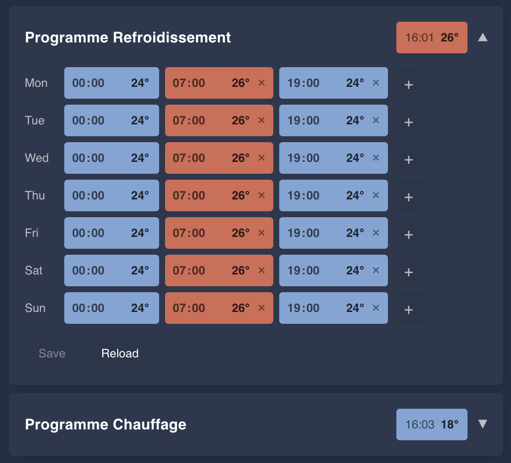

# 🏠 Atlantic Cozytouch

A Home Assistant integration for Atlantic's Cozytouch cloud -- boilers, heat
pumps, water heaters, towel rails and air conditioners.

Atlantic runs several protocols behind the Cozytouch brand. This one talks to
the API the Cozytouch mobile app uses, which is not the one the official
`overkiz` integration covers -- so it fills the gap for the hardware Overkiz
does not see.

## 📬 Contact

For anything about a device -- unmapped model, wrong entity, a value that reads
nothing like the app -- open an [issue](https://github.com/mathieuletyrant/cozytouch-hacs/issues)
and attach the diagnostics dump. A report without the dump cannot be acted on,
and an issue keeps the answer where the next person with that model will find
it.

For anything else -- something you would rather not post in public, or a
question that is not about the code -- <midtown_saucers9e@icloud.com>.

## ✨ What it does

You get the climate entity you would expect : temperature, mode, and fan and
swing where the hardware has them, with the room temperature read back. On top
of that :

- the weekly program the device runs on its own, read and written from Home
  Assistant, and shown as a calendar
- sensors per device for energy, water, wifi signal and decoded error codes
- device triggers for schedule changes and program overrides, on top of the ones
  Home Assistant builds itself
- a diagnostics dump that an unmapped device points you at by itself
- an interface in English, French, Spanish, German and Italian, following the
  language Home Assistant is set to

Everything runs over the cloud : one login, one poll for the whole account,
every 30 seconds by default.

## 📋 Supported devices

Every Cozytouch device is identified by a numeric `modelId`, and each one needs
its own mapping before its capabilities turn into Home Assistant entities. The
tables below are the whole of what is mapped today.

These mappings come from two sources, and the difference matters when you read
a table row.

Some were built from a single user's capture of their own unit. They say what
that device reported -- not that every feature has been exercised on every
variant.

The rest, and today that is most of them -- 131 of the 203 ids below -- were
never captured at all. Atlantic's own model catalogue lists them in a product
line whose other cells *were* captured: the same appliance in another volume,
another finish, another brand badge or another country. Those take the answer
their captured sibling gives and their own name, and nothing else; in
`model.py` each one is marked `# catalogue only`. It is a good guess about
hardware nobody here has seen, which is worth saying plainly: if one of them
is yours and something reads wrong, that is the mapping and not your device --
send the dump.

**Some ids are slots, not products.** A gateway reports each room it drives
under its own `modelId`, counting from the first : the vendor's catalogue calls
them `ROOM_0`, `ROOM_1`, … and `UI_0`, `UI_1`, … An id in one of those ranges
says *which room*, never what the hardware in it is -- so the same `modelId`
is an air conditioner on one account and a radiator on another, and what tells
them apart is the gateway it hangs off. Adding the gateway is what brings its
rooms in.

### 🔥 Boilers / Chaudières

| Range | modelId | Model |
| ----- | ------: | ----- |
| Naema / Naia | 1-12 | Naema / Naia (12, 20, Micro 25-35, Duo 30-35) |
| Naema / Naia | 253-254, 256-261, 265-267, 269-270 | Naema / Naia variants (Sr, SP, Cuerpo Caldera) |
| Naema 2 / Naia 2 | 54-69 | Naema 2 / Naia 2 (12, 20, Micro 25-35, Duo 25-35 HE) |
| Naema 2 / Naia 2 | 227 | Naema 2 30 |
| Naema 3 | 1444-1446 | Naema 3 Micro 25, 30, 35 |
| Naema 3 | 1447, 1448 | Naema 3 Duo 25, 35 |

### ♨️ Heat pumps / Pompes à chaleur

| Range | modelId | Model |
| ----- | ------: | ----- |
| Alfea | 76 | Alfea Extensa Duo AI UE |
| Alfea | 211 | Alfea Extensa Duo A.I. 3 R32 |
| Alfea | 219 | Alfea Extensa Duo A.I. 3 R32 Thermor |
| Alfea | 2295-2317 | Alfea Extensa S, S Duo, S Duo XL (interface) |
| Alfea | 2326-2328 | Alfea Extensa S, S Duo, S Duo XL (generator) |

### 🎛️ Thermostats

| Range | modelId | Model |
| ----- | ------: | ----- |
| Loria | 418 | Loria 3 Duo R32 |
| Navilink | 235 | Thermostat Navilink Connect |

### 🚿 Water heaters / Chauffe-eau

Grouped by product line, since Atlantic sells the same tank under several
badges and volumes -- the line is what tells you whether a row is yours.

| Range | modelId | Model |
| ----- | ------: | ----- |
| Aeromax | 1370-1372 | Aeromax SPLIT 3 |
| Aeromax | 1656 | Aeromax 6 |
| Aeromax | 1669, 1670 | CV5 Aeromax Premium 100L, 150L |
| Aqueo | 389 | AQUEO ACI HYB VS 300L 3000M |
| Aqueo | 390, 391 | AQUEO ACI HYB VM 150L, 200L 2200M |
| Calypso | 664, 1369 | Calypso Split |
| Calypso | 1367 | Calypso SPLIT VM 150L |
| Calypso | 754, 1368 | Calypso SPLIT VM 200L |
| Calypso | 1657 | Calypso 200L |
| Calypso | 1658 | Calypso connecté |
| Duralis | 392 | DURALIS CONNECT ACI HYB VS 300L 3000M |
| Duralis | 393, 394 | DURALIS CONNECT ACI HYB VM 150L, 200L 2200M |
| Duralis | 1364-1366 | THE DURALIS CONNECT VM 150, VM 200, VS 300 PE |
| Egeo | 957, 2345 | Egeo VS 200L |
| Egeo | 1010, 2346 | Egeo VS 250L |
| Egeo | 2347-2352 | the same platform under the TH / SA / ATE / THE badges, named as the catalogue names it (`TD … VS … 1800M TYB CA`) |
| Explorer | 1641-1645 | Atlantic Explorer V5 (200L, 270L, 200L with coil, 240L, 270L with coil) |
| Explorer | 1646-1655, 1659-1664 | the same platform under the THE / AE / TH / SA / ATS / NEU badges, named as the catalogue names it (`TD … VS … 1200M TYB V5S`) |
| Explorer | 2374-2376 | Explorer EVO 3 (270L) |
| Lineo | 1954-1957 | LINEO CONNECTE MP 040L, 065L, 080L, 100L 2250W |
| Malicio | 1961-1964 | Thermor Malicio 3 MP 40L, 65L, 80L, 100L |
| Malicio | 1965-1967 | Thermor Malicio 3 VM 100L, 120L, 150L |
| Phazy | 236 | Sauter Phazy |
| Phazy | 386 | PHAZY VS 300L 3000M |
| Phazy | 387, 388 | PHAZY VM 150L, 200L 2200M |

### 🧖 Towel racks / Sèche-serviettes

| Range | modelId | Model |
| ----- | ------: | ----- |
| Asama | 1540-1555 | Asama Connecté II, 500W to 1750W, BLC / ANTH / NOIR / CAPP |
| Doris | 1562, 1563, 1587-1600 | Doris étroit, 300W to 1500W, BLC / ANTH / CARAT / NOIR |
| Kelud | 1381 | KELUD 1750W BLC |
| Kelud | 1382 | KELUD 1750W Anthracite Standard |
| Riva | 1564, 1565, 1622-1635 | Riva 5 étroit, 300W to 1500W, BLC / ARDOISE / MENHIR / CARBONE |

### 🏠 Room slots / Emplacements de pièce

These are the slot ranges, and what the gateway makes of them. `ROOM_0` to
`ROOM_8` share one numbering split across two id blocks -- 557-561 for the
first five rooms, 1734-1737 for the next four.

| modelId | Slot | Behind | Mapped as |
| ------: | ---- | ------ | --------- |
| 557-561 | `ROOM_0`-`ROOM_4` | a CozyBox (2447-2450) | Radiator |
| 557-561 | `ROOM_0`-`ROOM_4` | an Alfea Extensa S interface (2295-2317) | Heating circuit |
| 557-561 | `ROOM_0`-`ROOM_4` | a Naviclim (556) or Navizone (1681, 1758) | Air conditioner |
| 1734-1737 | `ROOM_5`-`ROOM_8` | a HUB Cozytouch (1457) | Air conditioner |
| 562-570 | `UI_0`-`UI_8` | any of the above | Air conditioner user interface |
| 1376 | `DHW_0` | an appliance that heats water | Domestic hot water |
| 1388-1390 | `TESC_0`-`TESC_2` | an appliance that heats | Heating circuit |

A room slot behind a gateway this table does not know falls through to the air
conditioner mapping, which is what the first five ids were read as before the
radiators turned up. If yours is a radiator and arrives as an air conditioner,
that is the bug -- send the diagnostics dump and say which gateway it sits on.

### 📡 Gateways / Passerelles

| Range | modelId | Model |
| ----- | ------: | ----- |
| Calypso | 1353 | Calypso Split Interface |
| CozyBox | 2447-2450 | Hub IO, Sauter / Thermor / Atlantic / Inter (CozyBox) |
| Cozytouch | 1457 | HUB Cozytouch |
| FLAT/S4 | 1763 | FLAT/S4 IOTHUB |
| Naviclim | 556 | Naviclim Hub |
| Navizone | 1681, 1758 | HUB Navizone |

### ❓ My device is not listed

It will show up under its commercial name if Atlantic's own catalogue knows the
model, and as `Unknown product (…)` otherwise -- either way only its generic
capabilities will work, because a name is all the catalogue gives. Home Assistant says so on its own : an unmapped device raises a repair
under `Settings -> System -> Repairs`. Opening it hands you a link to an issue
already carrying every unmapped model on the account, with the capability ids
nothing names for each and nothing else about your home -- so a gateway with
three unknown zones is one issue, not four. Attach the dump below to it -- one
per unmapped device, since a dump carries the capability values of the device
it came from and identity only for the rest -- and answering that one dialog
stops the others asking too. A release that adds a mapping clears them either
way.

To do it by hand instead, open an [issue](https://github.com/mathieuletyrant/cozytouch-hacs/issues)
and attach a diagnostics dump :

`Settings -> Devices & Services -> Atlantic Cozytouch -> ⋮ -> Download diagnostics`

One file covers the whole account. It lists every device the API reports with
its model id, says which ones the mapping already knows, and for each of them
which capability ids nothing names yet -- including the devices you have not
added, which is usually where an unmapped model is. That last list is what a
mapping is built from. Your credentials and address are stripped out before
the file is written.

If you want to see the unmapped capabilities as entities in the meantime, tick
`Create entities for unknown capabilities` when adding the account, under
Configuration below. It is useful for working out what a value means, and noisy
enough that you will want it off again afterwards.

## 📦 Installation

### With HACS

This integration is not in the HACS default store, so add it as a custom
repository first :

Or by hand, in HACS : `⋮ -> Custom repositories`, URL
`https://github.com/mathieuletyrant/cozytouch-hacs`, type `Integration`. More
about HACS [here](https://hacs.xyz/).

### Manually

Clone this repository, copy `custom_components/cozytouch` into your Home
Assistant config directory (so `config/custom_components/cozytouch`), and
restart Home Assistant.

## ⚙️ Configuration

Go to `Settings -> Devices & Services -> Add an integration`, search for
`cozytouch`, pick `Atlantic Cozytouch` and enter your Cozytouch credentials.

If the connection works, you get the list of devices on your account : the
gateway and each unit it reports. Tick the ones you want entities for. You get
one entry for the account, with one device per device you picked, so the
credentials are sent once and the account is polled once whatever you own.

To add a device later, use `Add device` on the integration page. To stop
following one, delete it from there.

Values refresh every 30 seconds by default. One request covers the whole
account, so ticking more devices does not make the integration talk to Atlantic
more often. You can change the interval under `Configure` on the integration
page; 15 seconds is the lowest it accepts, and below that the requests stop
buying anything -- Atlantic's cloud hears from your hardware on its own
schedule, whatever we ask it.

Only some values are mapped so far. `Create entities for unknown capabilities`
turns every capability the API reports into an entity, mapped or not, which is
how a mapping gets worked out. It applies to the whole account.

> Upgrading from an earlier release : the integration used to be set up
> one entry per device, and there is no automatic migration -- Home Assistant
> will say the entry cannot be migrated. Remove the integration and add it
> again. The devices and their entities are recreated under the account, which
> means new entity ids, so a dashboard or an automation naming them has to be
> pointed at the new ones.

## 🗓️ Scheduling

A Cozytouch device holds its own weekly program -- the one the app calls
*Chauffage* and *Refroidissement* -- and keeps running it when Home Assistant
is off. That is the difference with scheduling the climate entity from an
automation.

Four ways to reach it, all documented in **[docs/scheduling.md](docs/scheduling.md)** :

| | |
| --- | --- |
| **Actions** | `cozytouch.set_schedule` writes a day to as many days as you pick, `cozytouch.get_schedule` reads a week back in the shape the other one takes. |
| **Triggers** | Five device triggers, so an automation can run when the program changes what it is asking for. |
| **Entities** | A calendar per program, plus a sensor per day, so the week is visible without a card. |
| **The card** | `custom:cozytouch-schedule-card`, served by the integration : a chip per slot, and the setpoint in charge right now when it is closed. |
| **Your voice** | Assist can read the program and hold a temperature between two times, if your conversation agent can use tools. |

A day holds ten slots at most, the first has to start at `00:00`, and
temperatures are whole degrees. Heating and cooling only.
## 🏷️ Versioning

Releases use CalVer : `YEAR.MONTH.PATCH` (ex : `2026.8.0`).

`main` is protected, so a release is two steps. First a pull request setting
`version` in `custom_components/cozytouch/manifest.json` to the version being
released ; then a `Release` workflow dispatch naming that same version. The
workflow refuses to run while the manifest says something else, and otherwise
tags the commit and writes the notes from the commit subjects since the
previous tag.

## 🙏 Credits

This integration started as a fork of [gduteil/cozytouch](https://github.com/gduteil/cozytouch)
and is now maintained independently here. All the original work is theirs.

Several device mappings come from pull requests opened against that project by
people who owned the hardware and worked out what it reported. Their work is
here because they did it :

| Device | modelId | By |
| ------ | ------: | -- |
| ACI HYB water heaters (PHAZY / AQUEO / DURALIS) | 386-394 | [@FreeTHX](https://github.com/FreeTHX), [@beorn-](https://github.com/beorn-) |
| Doris étroit 1300W CARAT | 1595 | [@tomcastleman](https://github.com/tomcastleman) |
| Doris étroit 1500W BLC | 1588 | [@jojeju9428](https://github.com/jojeju9428) |
| Calypso connecté | 1658 | [@picosam](https://github.com/picosam) |
| FLAT/S4 IOTHUB gateway | 1763 | [@Joonel](https://github.com/Joonel) |
| Thermor Malicio 3 65L | 1962 | [@genmllc](https://github.com/genmllc) |
| Egeo VS 250L | 2346 | [@Mathieu-Pasco-Breillot](https://github.com/Mathieu-Pasco-Breillot) |
| Explorer EVO 3 (270L) | 2374 | [@StefanWokusch](https://github.com/StefanWokusch) |
| Calypso SPLIT VM 200L | 1368 | [@mplessis](https://github.com/mplessis) |
| CV5 Aeromax Premium 100L | 1669 | [@Racailloux](https://github.com/Racailloux) |

Where only part of a pull request was taken, the commit that took it says which
part and why the rest was left alone.
